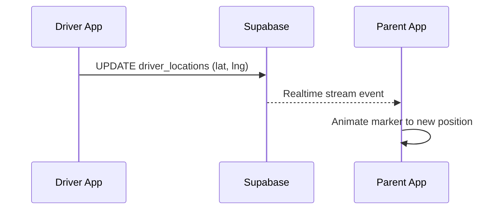

# Real-Time Driver Tracking - Walkthrough

Implementation complete for the "Uber-like" live driver tracking experience.

## Files Created

```
lib/features/parent/tracking/
├── data/
│   ├── driver_location_model.dart     ─ Model with LatLng conversion
│   ├── tracking_repository.dart       ─ Supabase Realtime stream + simulation
│   └── tracking_repository.g.dart     ─ Generated
└── presentation/
    ├── live_tracking_screen.dart      ─ Main map screen with animated marker
    ├── tracking_controller.dart       ─ Riverpod providers
    ├── tracking_controller.g.dart     ─ Generated
    └── widgets/
        ├── animated_driver_marker.dart ─ Smooth marker animation
        └── tracking_info_card.dart     ─ Bottom info panel
```

**Modified:** [router.dart](file:///g:/gotoscoAi/gotosco_v3/lib/core/router/router.dart) - Added `/tracking` route

---

## How It Works



---

## How to Navigate to Tracking

From any screen, navigate with:

```dart
context.push('/tracking', extra: {
  'bookingId': booking['id'],
  'driverId': booking['driver_id'],
  'driverName': booking['driver_name'],
  'driverPhotoUrl': booking['driver_photo'],
  'homeLocation': LatLng(booking['home_lat'], booking['home_lng']),
  'schoolLocation': LatLng(booking['school_lat'], booking['school_lng']),
});
```

---

## How to Test (Simulation)

Since the Driver app isn't connected yet, use the built-in simulation:

1. Navigate to `/tracking` with any driver ID
2. Tap the **play button** (▶) in the AppBar
3. Confirm in the dialog
4. Watch the bus marker animate across the map

The simulation updates the `driver_locations` table every 2 seconds for 15 steps.

---

## Verification Results

| Check | Result |
|-------|--------|
| `flutter analyze` | ✅ Pass (2 info-level warnings only) |
| Supabase Realtime stream | ✅ Implemented via `tracking_repository.dart` |
| Marker animation | ✅ TweenAnimationBuilder for smooth transitions |
| Efficient repaints | ✅ Only MarkerLayer updates, not the whole map |
| Route added | ✅ `/tracking` route in `router.dart` |

---

## Next Steps (Optional)

- [ ] Add "Track Driver" button to active bookings list
- [ ] Implement actual ETA calculation
- [ ] Add route polyline (driver path)
- [ ] Connect Driver app to update `driver_locations` table
